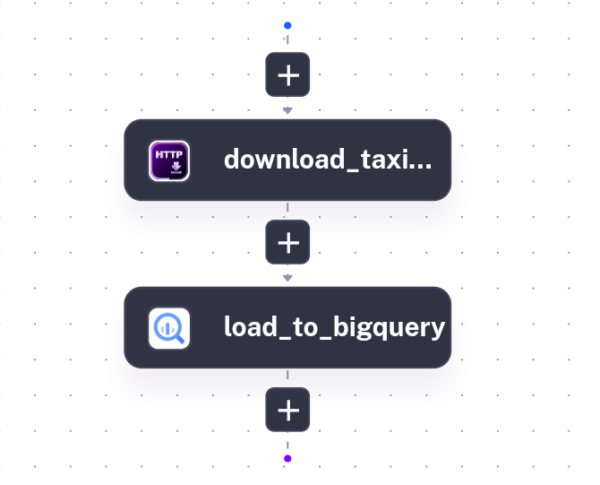

# llm-zoomcamp-hw3

## Question 1: Context Engineering
Answer: AI Copilot has access to current Kestra plugin documentation

The quality of an LLM's response depends not so much on the model's power as on the quality of the provided context.

Prompt: `Create a Kestra flow that loads NYC taxi data from CSV to BigQuery`  

**ChatGPT's flow has an error**:
> Validation error: Unrecognized field "bucket" (class io.kestra.plugin.gcp.gcs.Upload) not marked as ignorable (28 known properties: ...)

```yaml
id: nyc_taxi_csv_to_bigquery
namespace: demo.bigquery

description: Load NYC Taxi CSV into BigQuery

variables:
  project_id: your-gcp-project
  dataset: nyc_taxi
  table: yellow_tripdata
  bucket: your-gcs-bucket
  file: yellow_tripdata_2024-01.csv
  url: https://d37ci6vzurychx.cloudfront.net/trip-data/yellow_tripdata_2024-01.csv

tasks:

  - id: download_csv
    type: io.kestra.plugin.core.http.Download
    uri: "{{ vars.url }}"

  - id: upload_to_gcs
    type: io.kestra.plugin.gcp.gcs.Upload
    from: "{{ outputs.download_csv.uri }}"
    bucket: "{{ vars.bucket }}"
    name: "{{ vars.file }}"

  - id: create_dataset
    type: io.kestra.plugin.gcp.bigquery.Query
    projectId: "{{ vars.project_id }}"
    sql: |
      CREATE SCHEMA IF NOT EXISTS `{{ vars.project_id }}.{{ vars.dataset }}`;

  - id: create_table
    type: io.kestra.plugin.gcp.bigquery.Query
    projectId: "{{ vars.project_id }}"
    sql: |
      CREATE TABLE IF NOT EXISTS `{{ vars.project_id }}.{{ vars.dataset }}.{{ vars.table }}` (
          VendorID INT64,
          tpep_pickup_datetime TIMESTAMP,
          tpep_dropoff_datetime TIMESTAMP,
          passenger_count FLOAT64,
          trip_distance FLOAT64,
          RatecodeID FLOAT64,
          store_and_fwd_flag STRING,
          PULocationID INT64,
          DOLocationID INT64,
          payment_type INT64,
          fare_amount FLOAT64,
          extra FLOAT64,
          mta_tax FLOAT64,
          tip_amount FLOAT64,
          tolls_amount FLOAT64,
          improvement_surcharge FLOAT64,
          total_amount FLOAT64,
          congestion_surcharge FLOAT64,
          Airport_fee FLOAT64
      );

  - id: load_csv
    type: io.kestra.plugin.gcp.bigquery.Load
    projectId: "{{ vars.project_id }}"
    from: "gs://{{ vars.bucket }}/{{ vars.file }}"
    destinationTable: "{{ vars.project_id }}:{{ vars.dataset }}.{{ vars.table }}"
    format: CSV
    writeDisposition: WRITE_TRUNCATE
    createDisposition: CREATE_NEVER
    autodetect: false
    skipLeadingRows: 1
```

**Kestra's AI Copilot**
Looks reasonable.  
```yaml
id: mink_737973
namespace: company.team

tasks:
  - id: download_taxi_data
    type: io.kestra.plugin.core.http.Download
    uri: https://raw.githubusercontent.com/plotly/datasets/master/Taxi%20Trip%20Data.csv
  - id: load_to_bigquery
    type: io.kestra.plugin.gcp.bigquery.Load
    from: "{{ outputs.download_taxi_data.uri }}"
    destinationTable: "your_project_id.your_dataset.nyc_taxi_data" # Replace with your BigQuery project, dataset, and table
    format: CSV
    autodetect: true
    csvOptions:
      fieldDelimiter: ","
    # If your BigQuery project requires a specific service account, uncomment and set the following:
    # serviceAccount: "{{ secret('GCP_SERVICE_ACCOUNT') }}"
    # projectId: "your_project_id" # Replace with your GCP project ID
```



## Question 2: RAG vs No RAG

Run both 1_chat_without_rag.yaml and 2_chat_with_rag.yaml in the Kestra UI. Read the execution logs for each.  

The non-RAG response about Kestra 1.1 features is best described as:  
Vague, generic, or fabricated — the model guesses from training data

## Question 3: Token usage — short summary
What is the approximate output token count for multilingual_agent?
```
Multilingual Agent:
- Input tokens: 282
- Output tokens: 69
- Total tokens: 351
```
**Answer**: 60-100 tokens

## Question 4: Token usage — long summary
Run `4_simple_agent.yaml` again with summary_length = long.
```
Multilingual Agent:
- Input tokens: 282
- Output tokens: 184
- Total tokens: 466
```
Compare the `multilingual_agent` output token count to your result from Question 3. Roughly how many times more output tokens does the long summary use?  
184/69=2.7

**Answer**: 2-5x more

## Question 5: Modifying a flow
After changing english_brevity to ask for 3 sentences instead of 1, how does the output token count compare to the original 1-sentence version? (1 point)

1 sentence
```
English Brevity Agent:
- Input tokens: 199
- Output tokens: 54
- Total tokens: 253
```

3 sentences
```
English Brevity Agent:
- Input tokens: 183
- Output tokens: 101
- Total tokens: 284
```
101/54=1.87

**Answer**: 2-4x more

## Question 6: Best Practices
Based on what you learned in this module, for production workflows requiring deterministic, repeatable results with strict compliance requirements (e.g., financial reporting, workflows in highly regulated industries), which approach is most appropriate?

**Answer**: Use traditional task-based workflows for predictability and auditability
